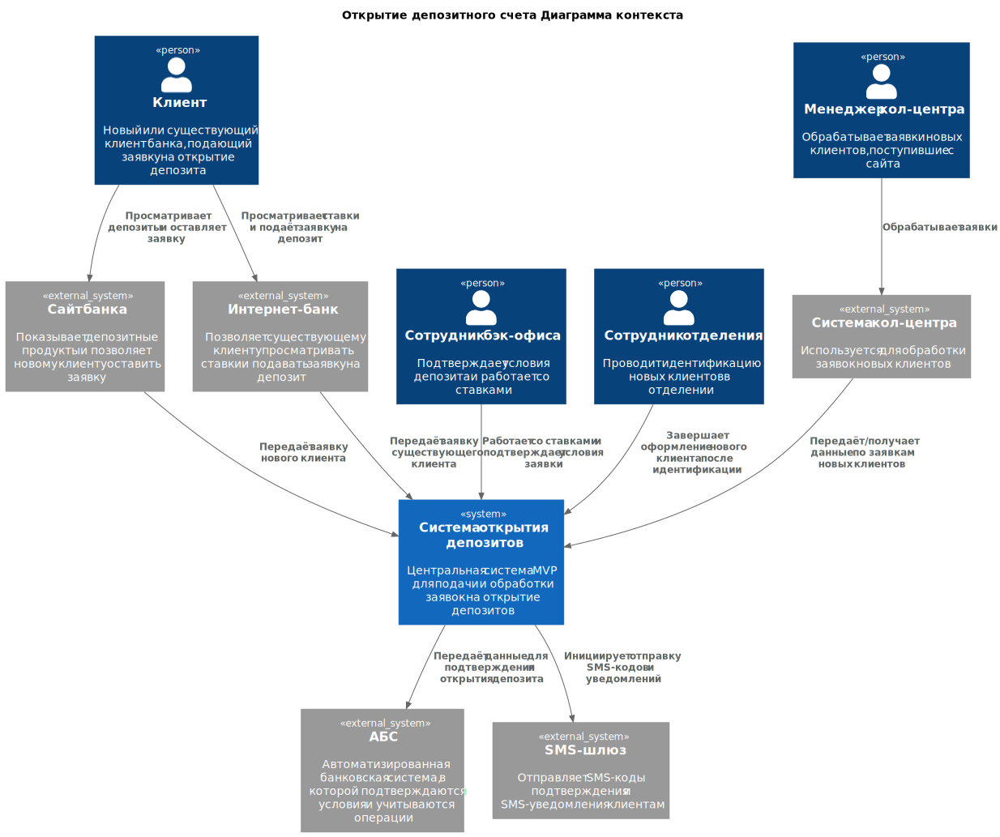
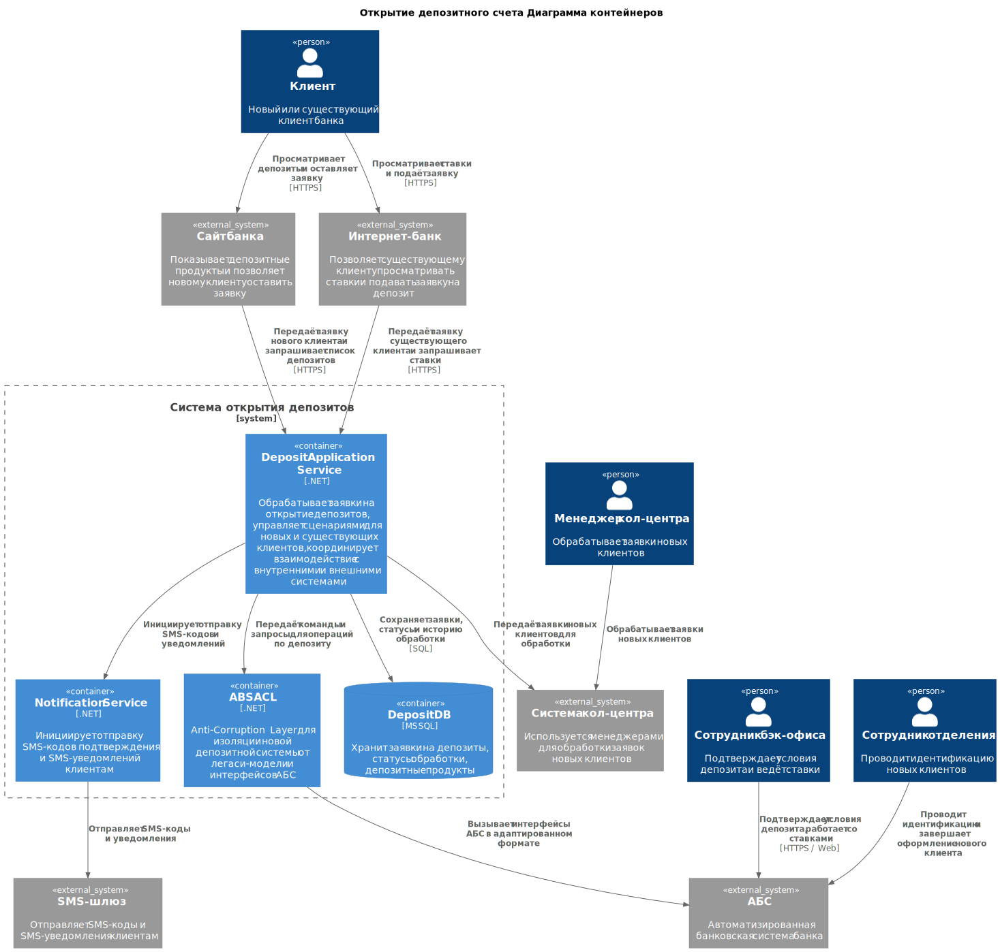

### **Название задачи: Открытие депозитного счета. Продвинутый формат** 
### **Автор: Старков Никита**
### **Дата: 05.04.2026**
### **Функциональные требования**

|**№**|**Действующие лица или системы**|**Use Case**|**Описание**|
| :-: | :- | :- | :- |
| UC1 | 1.Клиент  2.Сотрудник и система кол-центра  3.Сотрудник фронт-офиса  4.Бэк-офис  5.Сайт  6.АБС  7.SMS-шлюз | Процесс открытия депозита для новых клиентов| 1. Клиент просматривает депозиты и ставки на сайте   2. Клиент оставляет заявку (ФИО, телефон)   3. Заявка передаётся в систему кол-центра   4. Менеджер кол-центра связывается с клиентом   5. Клиент приходит в отделение для идентификации   6. Сотрудник отделения оформляет депозит   7. Бэк-офис подтверждает условия в АБС   8. АБС инициирует отправку SMS   9. Клиент получает SMS-уведомление |
| UC2 | 1.Клиент  2.Интернет-банк  3.АБС  4.Бэк-офис  5.SMS-шлюз| Процесс открытия депозита для существующих клиентов |1. Клиент входит в интернет-банк   2. Просматривает доступные и персонализированные ставки   3. Выбирает счёт и сумму   4. Отправляет заявку   5. Подтверждает операцию через SMS-код   6. Заявка передаётся в бэк-офис   7. Бэк-офис подтверждает условия в АБС   8. АБС инициирует отправку SMS   9. Клиент получает SMS-уведомление |

### **Нефункциональные требования**

|**№**|**Требование**|
| :-: | :- |
| R1 | Доступность клиентских сервисов должна составлять не менее 99.9% и обеспечиваться 24/7 | Влияет на deployment, отказоустойчивость и использование резервного ЦОД |
| P1 | Время отклика пользовательских операций должно измеряться миллисекундами | Влияет на выбор паттернов интеграции, кэширование и выделение нагруженных компонентов |
| P2 | Решение должно выдерживать рост нагрузки от онлайн-заявок без деградации клиентских сценариев | Требует горизонтального масштабирования клиентских компонентов |
| S1 | Новая функциональность депозитов должна быть спроектирована с возможностью последующего выделения в отдельный сервис | Архитектурный драйвер для постепенного ухода от монолита интернет-банка |
| +R1 | Передача данных между клиентскими каналами и внутренними системами должна осуществляться по защищённым каналам | Обработка чувствительных данных требует шифрования трафика |
| +R2 | Текущая версия интернет-банка несовместима с Kafka | Ограничивает выбор брокера и способ построения асинхронного взаимодействия в MVP |
| +R3 | Интернет-банк реализован как монолит и работает в одном ЦОД | Ограничение текущей платформы, влияющее на масштабирование и отказоустойчивость |
| +R4 | АБС поддерживает только вертикальное масштабирование | Требует минимизации прямой нагрузки на АБС со стороны онлайн-каналов |
| +R5 | Для новых клиентов открытие депозита не может быть полностью дистанционным без идентификации в отделении | Регуляторное ограничение, определяющее границы MVP |
### **Решение**

### Обоснование выбора технологий для нового решения

Новая функциональность вынесена в отдельную депозитную систему с возможностью горизонтального масштабирования, Deposit Application Service, Notification Service и пользовательских интерфейсов. При этом нагрузка на АБС ограничивается только необходимыми бизнес-операциями подтверждения и открытия депозита.

Для обработки клиентских запросов используется отдельный слой сервисов и собственное хранилище депозитной системы. Это позволяет обслуживать операции чтения и создания заявок без обращения к перегруженной базе АБС в каждом пользовательском сценарии. Актуальные ставки и данные заявок обрабатываются в пределах новой системы, что уменьшает latency.

Во всех внешних интеграциях предполагается использование HTTPS/TLS. Это относится к взаимодействию клиента с сайтом и интернет-банком, а также к вызовам внутренних API. Передача чувствительных данных (ФИО, телефон, параметры заявки) осуществляется только по защищённым каналам.

В архитектуре MVP не вводится жёсткая зависимость клиентских каналов от Kafka. Основные клиентские сценарии реализуются через синхронные API-вызовы. При этом сама архитектура не исключает последующее введение брокера сообщений для внутренних событий депозитной системы.

Интеграция с АБС изолирована через отдельный слой ABS ACL, а основная нагрузка обработки заявок, хранения ставок и статусов выведена в новую депозитную систему с отдельной БД. АБС используется как система учёта и подтверждения, а не как центральная платформа для всех онлайн-операций.

Работа со ставками и согласование условий заявки переносятся из XLS-файлов в АБС, где уже сосредоточена обработка банковских операций. 
Это позволяет сократить объём изменений в MVP, сохранить привычный контур работы сотрудников бэк-офиса и исключить разработку отдельного back-office интерфейса в рамках первой итерации.

### **Альтернативы**

В качестве альтернативного варианта рассматривалось более глубокое вынесение депозитной логики из АБС в отдельный контур. 
В этом варианте, помимо клиентского слоя для сайта и интернет-банка, вводятся дополнительные компоненты:
- **Rate Management Service** — отдельный сервис для хранения и управления ставками по депозитам;
- **Back Office UI** — пользовательский интерфейс для сотрудников депозитного и кредитного бэк-офиса;
- **Message Broker** — брокер сообщений для асинхронной обработки внутренних событий системы.

### Описание альтернативы

В рамках данного подхода управление ставками и согласование условий заявки переносятся из XLS-файлов и частично из АБС в отдельный сервис ставок. 
Сотрудники бэк-офиса работают не напрямую в АБС, а через отдельный Back Office UI, который использует API новой депозитной системы. 
Это позволяет вынести из АБС не только клиентский цифровой поток, но и часть внутренней бизнес-логики, связанной с ведением ставок и обработкой депозитных заявок.

Для асинхронного взаимодействия между компонентами может использоваться отдельный брокер сообщений, совместимый с текущим технологическим ландшафтом банка. 
Поскольку текущая версия интернет-банка несовместима с Kafka, для MVP или следующего этапа могли бы рассматриваться другие варианты, например RabbitMQ. 
Брокер в таком подходе может использоваться для публикации событий:
- создание заявки;
- передача заявки в кол-центр;
- подтверждение условий бэк-офисом;
- открытие депозита;
- отправка SMS-уведомлений;
- обновление ставок.

### Преимущества альтернативного подхода

АБС перестаёт быть основным местом выполнения бизнес-логики по ставкам и согласованию депозитов. Это уменьшает зависимость новой функциональности от ограничений legacy-системы. Хранение ставок, заявок и промежуточных статусов переносится в отдельное хранилище новой системы, что снижает объём операций, проходящих через АБС. Компоненты новой системы, включая сервис ставок, API и обработку заявок, могут масштабироваться горизонтально независимо от АБС. 

Использование брокера сообщений позволяет отделить синхронные клиентские операции от фоновой обработки, снизить связанность компонентов и подготовить решение к дальнейшему развитию. Наличие отдельного Notification/Integration слоя и брокера сообщений упрощает подключение внешних систем, обработку повторов, ретраев и аудит событий.

### **Недостатки, ограничения, риски**

1. **Сохранение зависимости от АБС** — несмотря на вынос клиентского слоя, ключевая бизнес-логика (ставки, подтверждение условий) остаётся в АБС, что ограничивает гибкость изменений.
2. **Ограниченная масштабируемость** — АБС поддерживает только вертикальное масштабирование, что может привести к узким местам при росте нагрузки.
3. **Отсутствие выделенного управления ставками** — ставки ведутся в рамках существующего процесса (XLS/АБС), что затрудняет централизованное управление и развитие функциональности.
4. **Синхронные интеграции** — использование API-вызовов без брокера сообщений увеличивает связанность компонентов и чувствительность к отказам.
5. **Ограниченная отказоустойчивость интеграций** — при недоступности АБС или интеграционного слоя возможны сбои в обработке заявок.
6. **Технический долг legacy-систем** — архитектура зависит от существующих ограничений интернет-банка и АБС, что усложняет дальнейшую эволюцию.
7. **Ручные операции в процессе ставок** — использование XLS или ручных процедур повышает риск ошибок и задержек в обновлении данных.

## Ключевые риски выбранного решения

1. **Перегрузка АБС** - АБС остаётся центральной системой для бэк-офиса и подтверждения условий депозита, поэтому при росте числа онлайн-заявок может стать узким местом.
2. **Ограниченная масштабируемость legacy-контура** — АБС поддерживает только вертикальное масштабирование, что ограничивает дальнейший рост решения.
3. **Синхронная связанность интеграций** — отсутствие брокера сообщений в MVP упрощает реализацию, но повышает зависимость компонентов друг от друга и чувствительность к сбоям.
4. **Сохранение зависимости от legacy-систем** — часть логики по ставкам и обработке заявок остаётся в АБС, что усложняет дальнейшую эволюцию архитектуры.

