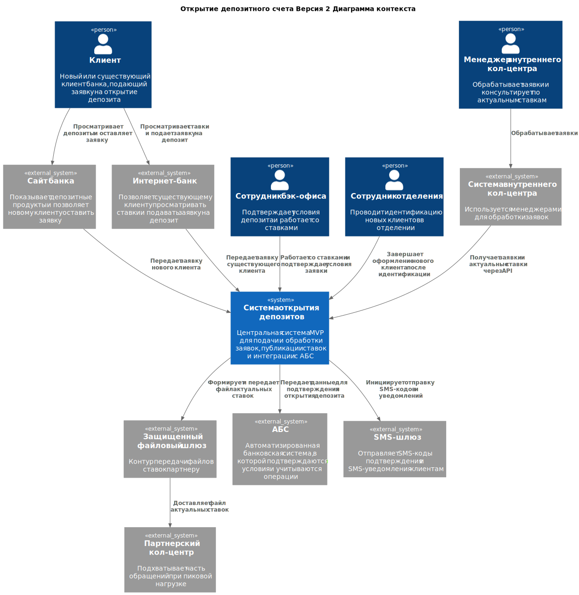
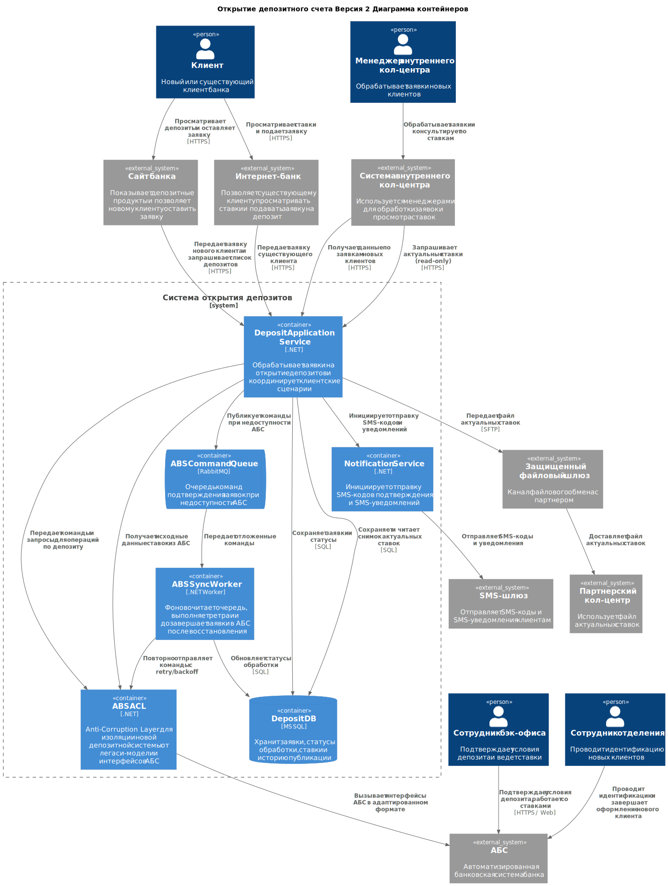

### **Название задачи: Открытие депозитного счета. Версия 2** 
### **Автор: Старков Никита**
### **Дата: 05.04.2026**
### **Функциональные требования**

|**№**|**Действующие лица или системы**|**Use Case**|**Описание**|
| :-: | :- | :- | :- |
| UC1 | 1.Клиент  2.Сотрудник и система кол-центра  3.Сотрудник фронт-офиса  4.Бэк-офис  5.Сайт  6.АБС  7.SMS-шлюз  8.Депозитная система (Deposit Application Service)  9.Партнёрский кол-центр | Процесс открытия депозита для новых клиентов| 1. Клиент просматривает депозиты и ставки на сайте   2. Клиент оставляет заявку (ФИО, телефон)   3. Заявка передаётся в систему кол-центра   4. Менеджер кол-центра связывается с клиентом   5. Сотрудник внутреннего кол-центра открывает read-only раздел со ставками и получает актуальные ставки через API депозитной системы (без ручного запроса в АБС)   При высокой нагрузке часть обращений может обрабатываться партнёрским кол-центром, который использует автоматически выгруженный файл актуальных ставок   6. Клиент приходит в отделение для идентификации   7. Сотрудник отделения оформляет депозит   8. Бэк-офис подтверждает условия в АБС   9. АБС инициирует отправку SMS   10. Клиент получает SMS-уведомление |
| UC2 | 1.Клиент  2.Интернет-банк  3.АБС  4.Бэк-офис  5.SMS-шлюз| Процесс открытия депозита для существующих клиентов |1. Клиент входит в интернет-банк   2. Просматривает доступные и персонализированные ставки   3. Выбирает счёт и сумму   4. Отправляет заявку   5. Подтверждает операцию через SMS-код   6. Заявка передаётся в бэк-офис   7. Бэк-офис подтверждает условия в АБС   8. АБС инициирует отправку SMS   9. Клиент получает SMS-уведомление |
---

### **Нефункциональные требования**

|**№**|**Требование**|**Комментарий**|
| :-: | :- | :- |
| R1 | Доступность клиентских сервисов должна составлять не менее 99.9% и обеспечиваться 24/7 | Влияет на deployment, отказоустойчивость и использование резервного ЦОД |
| R2 | RTO для клиентских сценариев открытия депозита не более 30 минут | Время восстановления после сбоя |
| R3 | RPO для заявок и ставок не более 5 минут | Допустимая потеря данных при аварии |
| P1 | 95-й перцентиль отклика пользовательских операций (просмотр ставок, отправка заявки) не более 300 мс | Влияет на выбор паттернов интеграции, кэширование и выделение нагруженных компонентов |
| P2 | Решение должно обрабатывать не менее 200 RPS онлайн-заявок при доле ошибок не более 1% | Требует горизонтального масштабирования клиентских компонентов |
| S1 | Новая функциональность депозитов должна быть спроектирована с возможностью последующего выделения в отдельный сервис | Архитектурный драйвер для постепенного ухода от монолита интернет-банка |
| +R1 | Передача данных между клиентскими каналами и внутренними системами должна осуществляться только по TLS 1.2+ (предпочтительно TLS 1.3) | Обработка чувствительных данных требует шифрования трафика |
| +R2 | Текущая версия интернет-банка несовместима с Kafka | Ограничивает выбор брокера и способ построения асинхронного взаимодействия в MVP |
| +R3 | Интернет-банк реализован как монолит и работает в одном ЦОД | Ограничение текущей платформы, влияющее на масштабирование и отказоустойчивость |
| +R4 | АБС поддерживает только вертикальное масштабирование | Требует минимизации прямой нагрузки на АБС со стороны онлайн-каналов |
| +R5 | Для новых клиентов открытие депозита не может быть полностью дистанционным без идентификации в отделении | Регуляторное ограничение, определяющее границы MVP |
| +R6 | Система должна обеспечивать предоставление актуальных депозитных ставок внутреннему и партнёрскому кол-центру |  |
| +R7 | Данные ставок для партнёрского кол-центра должны передаваться в виде файлов |  |
| +R8 | Должна быть обеспечена консистентность ставок между внутренними и внешними каналами |  |

---

### **Решение**

Новая функциональность вынесена в отдельную депозитную систему с возможностью горизонтального масштабирования, Deposit Application Service, Notification Service и пользовательских интерфейсов. При этом нагрузка на АБС ограничивается только необходимыми бизнес-операциями подтверждения и открытия депозита.

Для обработки клиентских запросов используется отдельный слой сервисов и собственное хранилище депозитной системы. Это позволяет обслуживать операции чтения и создания заявок без обращения к перегруженной базе АБС в каждом пользовательском сценарии. Актуальные ставки и данные заявок обрабатываются в пределах новой системы, что уменьшает latency.

Во всех внешних интеграциях предполагается использование HTTPS/TLS. Это относится к взаимодействию клиента с сайтом и интернет-банком, а также к вызовам внутренних API. Передача чувствительных данных (ФИО, телефон, параметры заявки) осуществляется только по защищённым каналам.

В архитектуре MVP не вводится жёсткая зависимость клиентских каналов от Kafka. Основные клиентские сценарии реализуются через синхронные API-вызовы. При этом внутри депозитной системы вводится асинхронный контур обработки как подстраховка интеграции с АБС при её недоступности.

Сценарий отказа АБС обрабатывается так:
- после валидации заявка фиксируется в депозитной системе со статусом `PENDING_ABS_CONFIRMATION`;
- команда подтверждения публикуется в очередь;
- воркер выполняет ретраи с backoff до успешной передачи в АБС;
- при исчерпании лимита попыток заявка переводится в `MANUAL_REVIEW`, а бэк-офис получает задачу на разбор;
- после восстановления АБС очередь дочитывается, и заявки дозавершаются без потери данных.

Интеграция с АБС изолирована через отдельный слой ABS ACL, а основная нагрузка обработки заявок, хранения ставок и статусов выведена в новую депозитную систему с отдельной БД. АБС используется как система учёта и подтверждения, а не как центральная платформа для всех онлайн-операций.

В выбранном решении для MVP управление ставками и согласование условий заявки выполняются в АБС (вместо XLS), без выделения отдельного сервиса ставок для бэк-офиса и без отдельного Back Office UI.
Это позволяет сократить объём изменений в первой итерации и сохранить привычный контур работы сотрудников бэк-офиса.

В рамках MVP реализуется механизм централизованного предоставления актуальных депозитных ставок для внутренних и внешних каналов обслуживания клиентов.

Актуальные ставки формируются на основе текущего процесса их ведения в АБС и публикуются через депозитную систему.

Депозитная система выполняет роль точки агрегации и распространения ставок и обеспечивает:
- предоставление ставок во внутреннюю систему кол-центра через API;
- формирование файла с актуальными ставками для партнёрского кол-центра.

Для внутреннего кол-центра реализуется read-only раздел со ставками, доступный сотрудникам, с возможностью фильтрации по параметрам депозитных продуктов.
Сотрудник кол-центра не вводит ставки вручную: интерфейс автоматически запрашивает и отображает актуальные ставки из `Deposit Application Service` по API.

Для партнёрского кол-центра реализуется механизм формирования и передачи файла с актуальными ставками.
Партнёрский кол-центр получает ставки из переданного файла и использует его как рабочий источник в своём контуре.

---

### **Обоснование выбора технологий для нового решения**

Новая функциональность вынесена в отдельную депозитную систему с возможностью горизонтального масштабирования, Deposit Application Service, Notification Service и пользовательских интерфейсов. При этом нагрузка на АБС ограничивается только необходимыми бизнес-операциями подтверждения и открытия депозита.

Дополнительно вводится функция публикации ставок в рамках Deposit Application Service.

Вместо прямых запросов в АБС при каждом обращении используется предварительно подготовленный набор актуальных ставок.

Это позволяет:
- снизить нагрузку на АБС;
- уменьшить latency;
- повысить отказоустойчивость;
- обеспечить единый источник данных.

### Описание альтернативы

В рамках данного подхода управление ставками и согласование условий заявки переносятся из АБС в отдельный сервис ставок.
Сотрудники бэк-офиса работают не напрямую в АБС, а через отдельный Back Office UI, который использует API новой депозитной системы. 
Это позволяет вынести из АБС не только клиентский цифровой поток, но и часть внутренней бизнес-логики, связанной с ведением ставок и обработкой депозитных заявок.

### Преимущества альтернативного подхода

АБС перестаёт быть основным местом выполнения бизнес-логики по ставкам и согласованию депозитов. Это уменьшает зависимость новой функциональности от ограничений legacy-системы. Хранение ставок, заявок и промежуточных статусов переносится в отдельное хранилище новой системы, что снижает объём операций, проходящих через АБС. Компоненты новой системы, включая сервис ставок, API и обработку заявок, могут масштабироваться горизонтально независимо от АБС. 
Отдельный Back Office UI и выделенный сервис ставок дают прозрачное управление тарифами, сокращают ручные операции и ускоряют вывод изменений для всех каналов обслуживания.

### **Недостатки, ограничения, риски**

1. **Сохранение зависимости от АБС** — несмотря на вынос клиентского слоя, ключевая бизнес-логика (ставки, подтверждение условий) остаётся в АБС, что ограничивает гибкость изменений.
2. **Ограниченная масштабируемость** — АБС поддерживает только вертикальное масштабирование, что может привести к узким местам при росте нагрузки.
3. **Отсутствие выделенного управления ставками** — ставки ведутся в рамках существующего процесса (XLS/АБС), что затрудняет централизованное управление и развитие функциональности.
4. **Высокая стоимость реализации на MVP** — добавление сервиса ставок и отдельного Back Office UI увеличивает сроки и бюджет первой итерации.
5. **Сложность миграции процессов** — потребуется перенос операционных процедур бэк-офиса в новый интерфейс и обучение сотрудников.
6. **Технический долг legacy-систем** — архитектура всё ещё зависит от существующих ограничений интернет-банка и АБС, что усложняет дальнейшую эволюцию.
7. **Повышенные требования к data governance** — нужен строгий контроль консистентности ставок между новым сервисом и учётным контуром АБС.
8. **Сложность интеграции партнёрского кол-центра** — требуется поддержка SLA файловой доставки и контроль версионности ставок.

---

## **Ключевые риски выбранного решения**

1. **Перегрузка АБС** - АБС остаётся центральной системой для бэк-офиса и подтверждения условий депозита, поэтому при росте числа онлайн-заявок может стать узким местом.  
2. **Ограниченная масштабируемость legacy-контура** — АБС поддерживает только вертикальное масштабирование, что ограничивает дальнейший рост решения.  
3. **Очередь подтверждения АБС может накапливаться в пике** — при длительной деградации АБС возможен рост backlog и увеличение времени финализации заявок.  
4. **Сохранение зависимости от legacy-систем** — часть логики по ставкам и обработке заявок остаётся в АБС, что усложняет дальнейшую эволюцию архитектуры.  
5. **Задержка обновления ставок** — возможна задержка между изменением ставок и их публикацией.  
6. **Рассинхронизация данных** — риск неконсистентности между каналами.  
7. **Зависимость от файловой доставки** — партнёр может использовать устаревшие данные при сбоях передачи.
